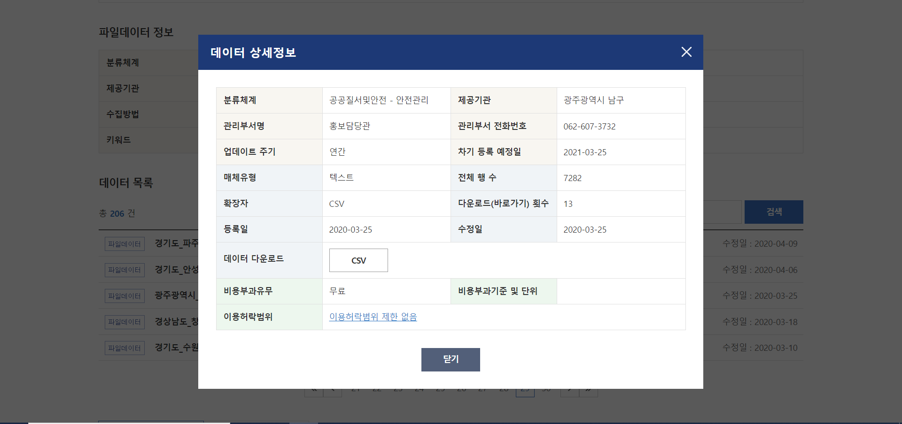
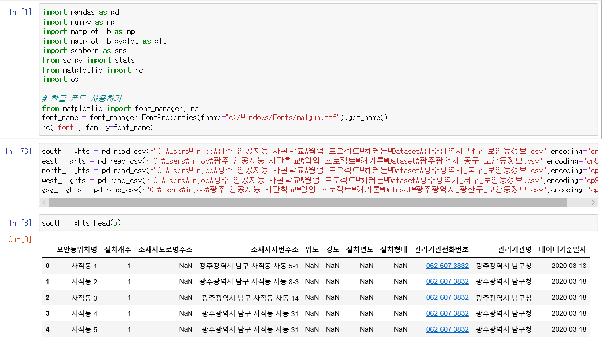
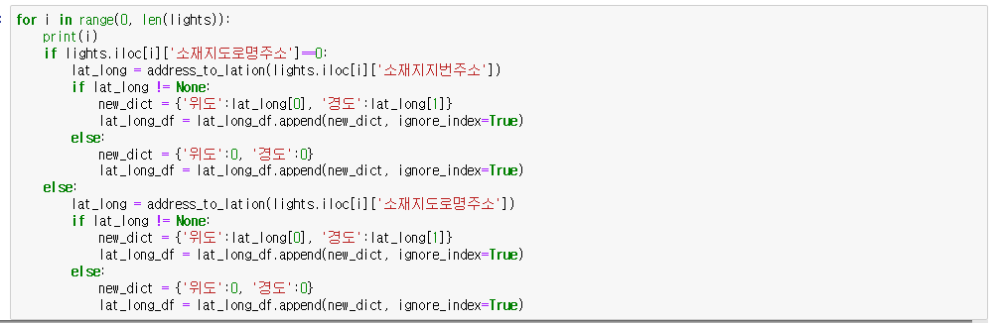
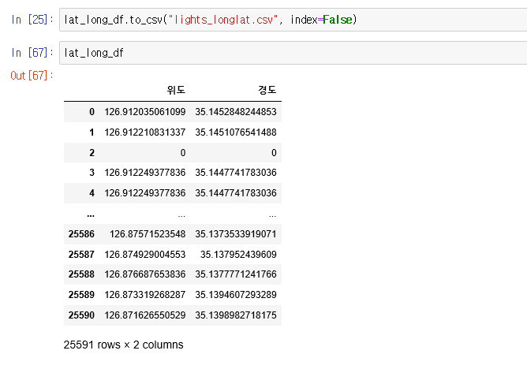
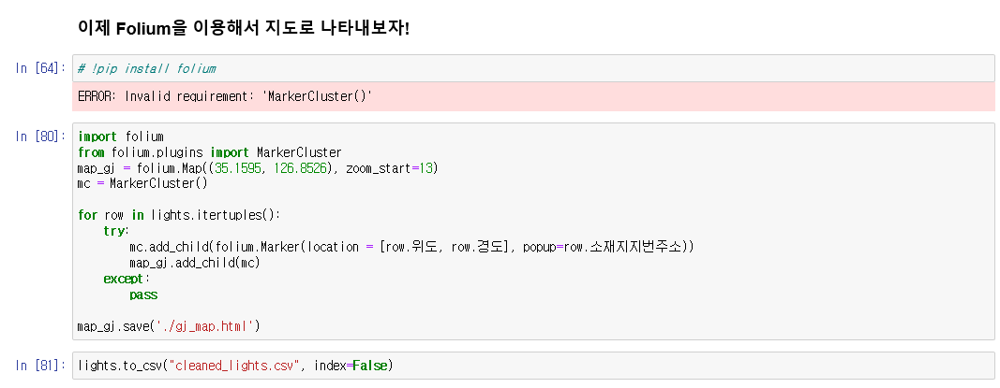
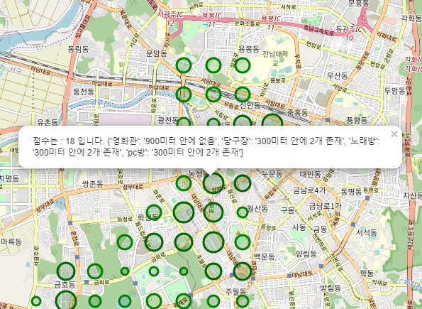
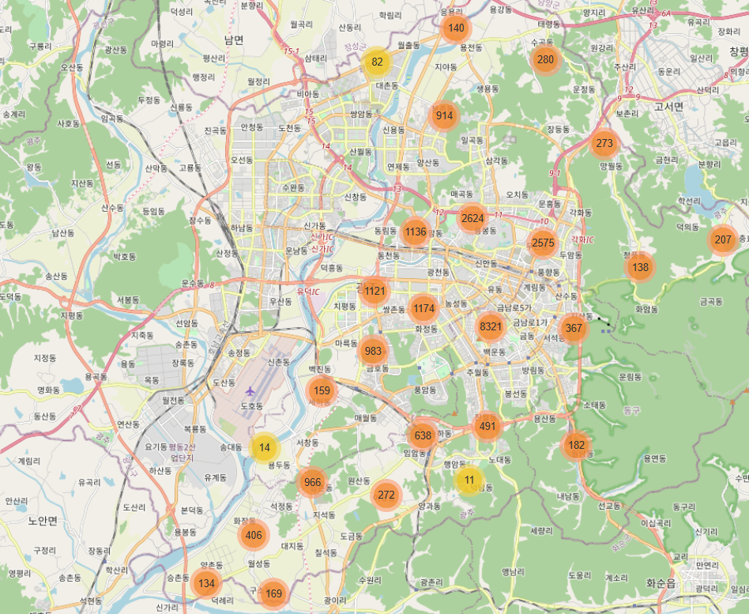
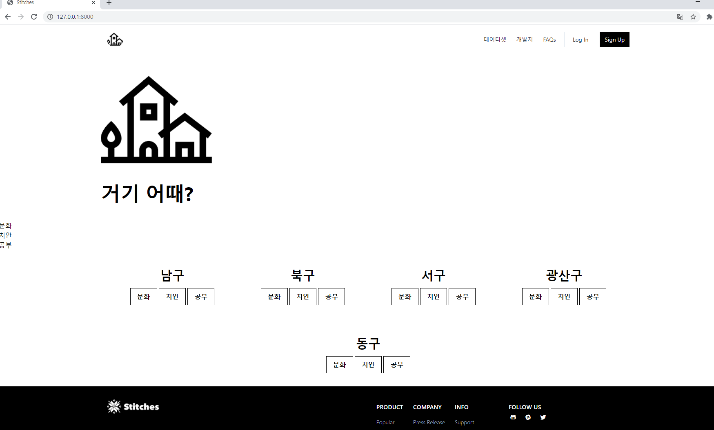

# 광주 인공지능 온라인 해커톤 

## 직접 돌아다니지 않고서도 언택트로 주거지의 교육, 문화 시설, 치안에 대한 점수를 알 수 있는 웹서비스 

#### 배경: 실제로 광주 인공지능 사관학교 교육을 받기 위해 타지에서 오는 학생들이 많았고, 타지에서 온 사람들은 각 동네에 대한 정보를 얻기 쉽지 않았다. 언택트 시대에 맞게 부동산을 돌아다니지 않고 정보를 얻을 수 있는 방법이 필요했다.

#### 참가 인원: 양시몬, 강동현, 김강원, 차범희, 손인준 
#### 데이터 출처: 공공데이터 (https://www.data.go.kr/tcs/dss/selectStdDataDetailView.do), 
#### 카카오 API (https://developers.kakao.com/docs/latest/ko/kakaologin/rest-api)

## 공공 데이터 
  

## 데이터 처리 
  
  
  
  

## Folium을 이용한 지도에 표시 
  
  

## 계획했던 웹 디자인
  
